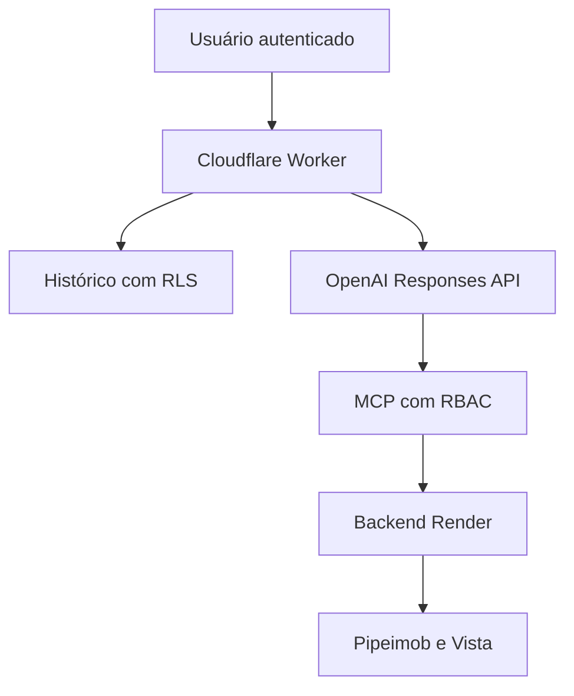

# Gralha Indicadores — arquitetura e operação

## Objetivo

O Gralha Indicadores é um portal conversacional de inteligência comercial. Ele consulta dados autorizados do Pipeimob e do Vista, responde em linguagem natural e apresenta gráficos executivos. O histórico pertence ao usuário autenticado e o acesso aos indicadores é limitado por cargo e equipe no servidor.

## Componentes e aplicativos

| Componente | Aplicativo/serviço | Responsabilidade |
|---|---|---|
| Portal web e API de borda | Cloudflare Workers | Login, interface, histórico, proxy administrativo, chamada da OpenAI e renderização dos gráficos |
| Identidade | Supabase Auth | Sessões, recuperação de senha e convites |
| Banco e autorização | Supabase Postgres + RLS | Perfis, cargos, equipes, histórico e políticas de isolamento |
| Administração | Supabase Edge Function `gralha-portal-admin` | Convites e alteração controlada de cargo, status e equipes |
| Indicadores | Supabase Edge Function `gralha-indicadores-mcp` | Servidor MCP, autorização por equipe e contratos de ferramentas |
| Geração de respostas | OpenAI Responses API | Interpretação da pergunta e resposta gerencial apoiada pelas ferramentas MCP |
| Backend de integração | FastAPI/Uvicorn no Render | Conciliação e leitura agregada das fontes operacionais |
| Fonte de vendas oficiais | Pipeimob API v2 | Quantidade oficial, data de venda e VGV |
| Fonte comercial/funil | Vista API | Negócios, status, etapa atual e atribuição comercial |
| Código e publicação | GitHub | Controle de versão; origem da publicação do Worker |
| Testes e deploy local | Pytest, Node test runner e Wrangler | Verificações automatizadas, sintaxe e empacotamento |

## Fluxo de uma pergunta

1. O portal valida a sessão no Supabase Auth.
2. A conversa é criada com o `user_id` autenticado.
3. A pergunta recebe uma chave idempotente para evitar duplicação em retentativas.
4. A consulta MCP carrega o cargo e as equipes autorizadas.
5. Usuários com escopo limitado recebem somente agregados das equipes permitidas.
6. Pergunta, resposta e visualização sanitizada são persistidas no histórico do próprio usuário.

## Matriz de acesso

| Cargo | Escopo de indicadores | Gestão de usuários |
|---|---|---|
| CEO | Geral | Sim |
| CSO | Geral | Sim |
| CMO | Geral | Sim |
| Diretor de loja | Uma ou mais equipes selecionadas | Não |
| Gerente de equipe | Exatamente uma equipe | Não |

O escopo é aplicado no Edge Function MCP. Ocultar controles na interface não é tratado como segurança. As políticas RLS também impedem que um usuário leia ou altere conversas de outro usuário.

## Modelo de dados

| Tabela | Finalidade |
|---|---|
| `profiles` | Perfil, status e cargo de acesso |
| `teams` | Diretório normalizado de equipes |
| `user_team_access` | Relação entre usuário e equipes autorizadas |
| `conversations` | Cabeçalho e título do histórico |
| `conversation_messages` | Mensagens, visualização e chave idempotente |
| `user_management_audit` | Auditoria de convites e alterações de acesso |
| `sales_team_reference` | Referência histórica corretor→equipe |
| `manager_team_reference` | Referência histórica gerente→equipe |
| `integration_failure_diagnostics` | Telemetria técnica sanitizada das integrações |

## Endpoints do portal

| Método e rota | Uso |
|---|---|
| `POST /api/login` | Criar sessão |
| `POST /api/refresh` | Renovar sessão |
| `POST /api/auth/recover` | Solicitar recuperação |
| `POST /api/auth/update-password` | Definir nova senha |
| `GET/POST /api/conversations` | Listar/criar conversas |
| `GET /api/conversations/:id/messages` | Abrir conversa |
| `PATCH/DELETE /api/conversations/:id` | Renomear/excluir conversa |
| `POST /api/chat` | Consultar e persistir resposta |
| `GET /api/admin/me` | Perfil e permissões atuais |
| `GET /api/admin/teams` | Equipes disponíveis no escopo |
| `GET/POST /api/admin/users` | Listar/convidar usuários executivos |
| `PATCH /api/admin/users/:id` | Atualizar acesso de usuário |

## Segurança e privacidade

- Tokens e chaves ficam em variáveis secretas dos serviços e não são persistidos no histórico.
- O Worker aplica CSP, bloqueio de frames, política de referência e restrições de permissões do navegador.
- O banco usa RLS e privilégios explícitos; `anon` não possui acesso às tabelas do portal.
- A Edge Function administrativa usa `service_role` somente depois de validar o token e o cargo executivo.
- O MCP retorna agregados. Dados pessoais e payloads brutos das fontes não são gravados nas conversas.
- O histórico não substitui os registros oficiais do Pipeimob ou Vista.

### Endurecimento do acesso ao histórico (proposta em revisão)

O Worker verifica o perfil atual (`status = active` e cargo reconhecido) antes das operações de histórico e de devolver respostas persistidas. Uma sessão Auth válida, por si só, não autoriza o histórico. A consulta usa o JWT do próprio usuário, sem cache, e falha de forma fechada se a validação não puder ser concluída.

O SQL proposto em `docs/security/portal_history_access_proposal.sql` reduz os privilégios de `profiles` e adiciona políticas RLS restritivas de perfil ativo ao histórico, preservando as políticas de propriedade existentes. **Esse SQL ainda não é uma migração publicada nem foi aplicado ao Supabase.** A proteção de acesso direto ao banco depende da validação e aplicação futura dessa proposta. Pré-requisitos, limitações e evidências estão em [GRALHA_HISTORY_ACCESS_HARDENING.md](GRALHA_HISTORY_ACCESS_HARDENING.md).

O teste isolado autorizado no GitHub Actions passou em 2026-09-03: 47 testes do Worker e 30 testes de PostgreSQL/RLS, com dados fictícios e sem acesso ao projeto Supabase existente. A divergência do histórico de migrações continua pendente; o resultado não autoriza merge, reconciliação ou publicação automática.

## Gráficos e identidade visual

O design usa superfícies claras, branco e cinza suave, azul institucional `#3d4788`, vinho `#7b3035` e cinza de apoio. Os gráficos suportados são barras/ranking, funil e múltiplos funis por equipe. Todos incluem título, legenda, valores e nota metodológica quando necessária.

## Publicação

1. Executar `pytest` para o backend.
2. Executar `node --test tests/worker_circuit_breaker.test.mjs`.
3. Executar `node --check cloudflare/gralha-indicadores-chat-worker-v11.js` e `git diff --check`.
4. Aplicar migrações do diretório `supabase/migrations` no projeto correto.
5. Publicar as Edge Functions `gralha-indicadores-mcp` e `gralha-portal-admin`.
6. Publicar o Worker por meio do repositório GitHub conectado ao Cloudflare.
7. Validar login, nova conversa, retorno à Home, reabertura do histórico e convite de usuário.

## Recuperação

- Edge Function: republicar a versão anterior disponível no Supabase.
- Worker: reverter o commit de publicação no GitHub e aguardar o deploy automático.
- Banco: criar uma migração corretiva; não apagar conversas ou perfis manualmente.
- Acesso incorreto: um executivo deve corrigir cargo/status/equipes pela gestão de usuários; a mudança é auditada.

## Limite atual para substituir o Power BI

O portal pode substituir o Power BI para as consultas e visualizações já cobertas pelos contratos Pipeimob/Vista. A substituição integral para análises por equipe depende da qualidade da atribuição corretor/negócio→equipe. Esse trabalho de ampliação de cobertura é uma fase separada e permanece pausado até validação ponto a ponto.
