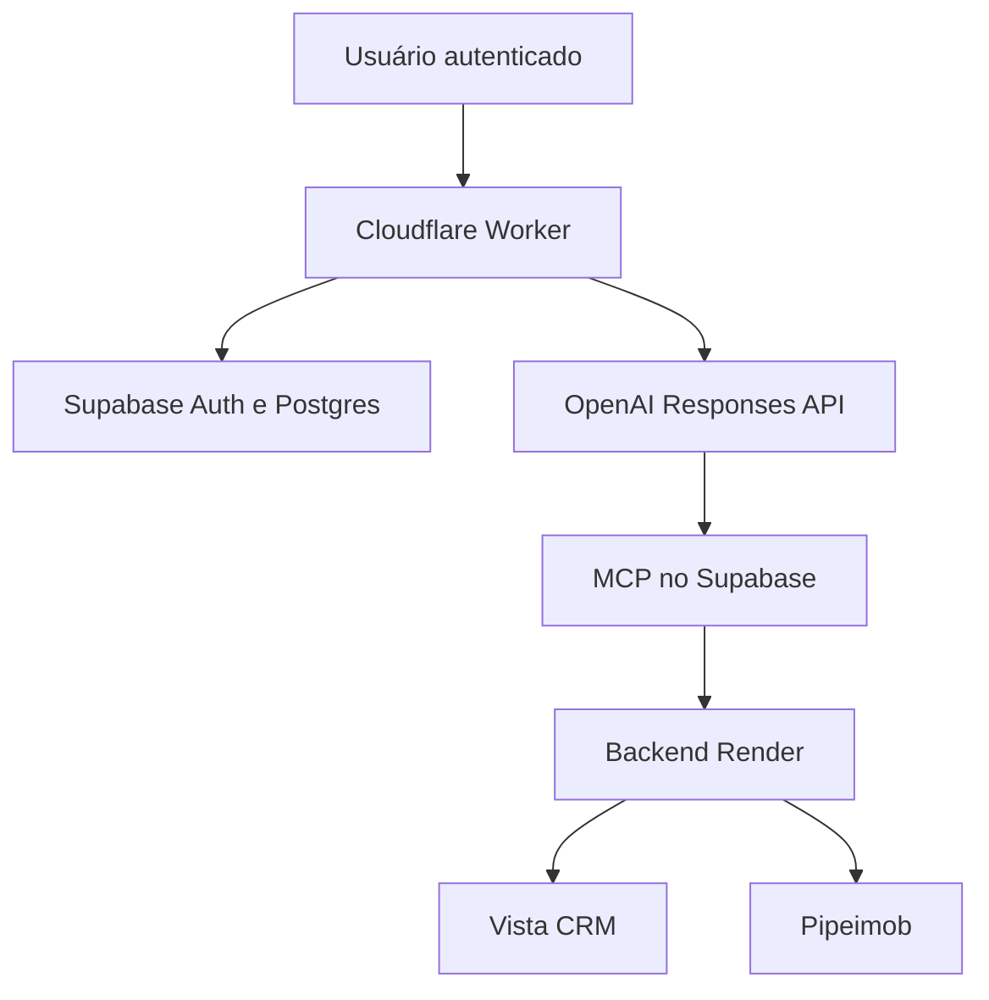
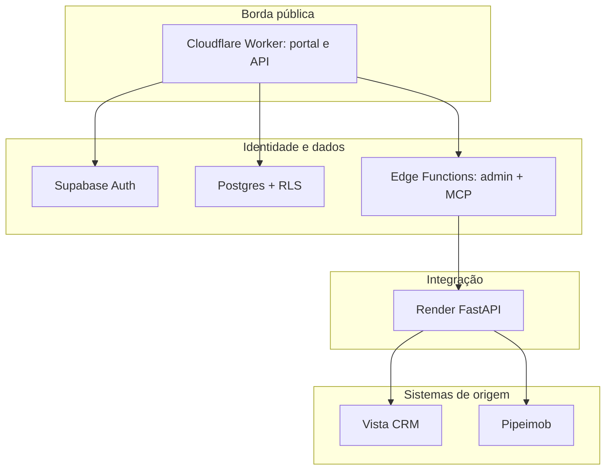
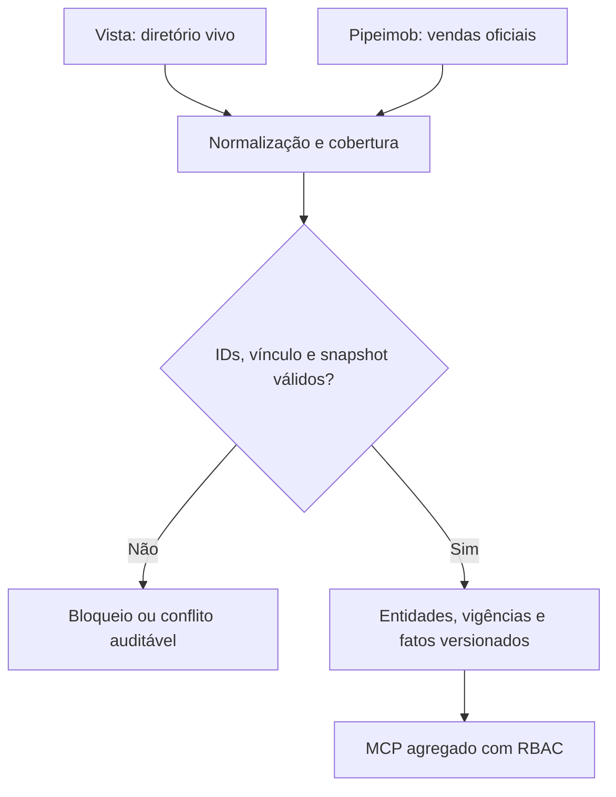
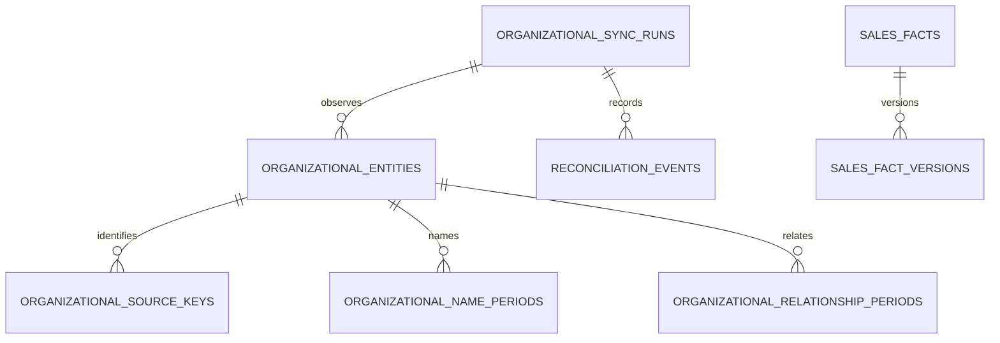
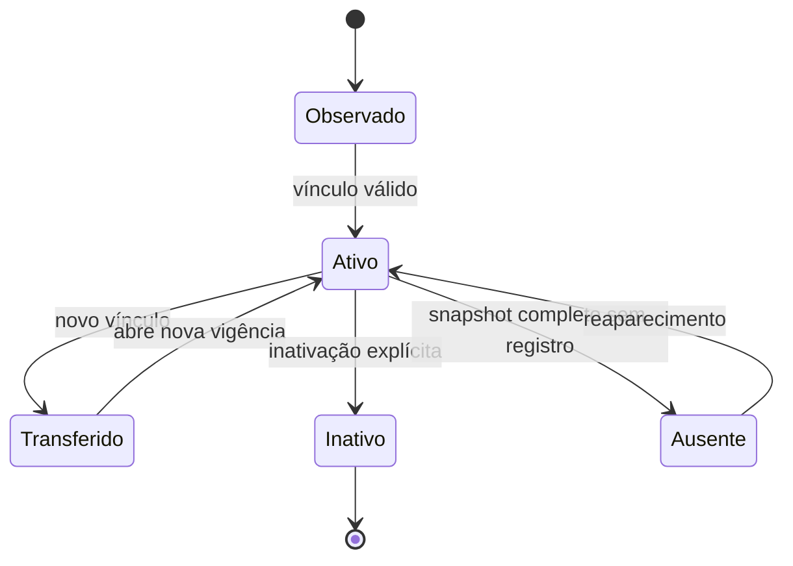

# Gralha Indicadores — arquitetura e operação v2

> **Versão documental:** 2.1-draft
>
> **Data de referência:** 2026-09-06
>
> **Baseline de código conhecida (`main`):** `1c713a8`
>
> **Integração do diagnóstico no portal:** `90dfaa7`, PR #38
>
> **Correção mais recente do diagnóstico:** `1c713a8`, PR #39
>
> **Regra:** a matriz de ambientes diferencia código integrado de versão publicada e validada.

## Objetivo

O Gralha Indicadores é um portal conversacional de inteligência comercial. Ele
consulta dados autorizados do Pipeimob e do Vista, responde em linguagem natural
e apresenta gráficos executivos. O histórico pertence ao usuário autenticado e
o acesso aos indicadores é limitado por cargo e equipe no servidor.

Esta versão também documenta a evolução para um diretório organizacional vivo e
um histórico comercial temporal. O objetivo é manter lojas, equipes, gerentes e
corretores atualizados sem cadastro manual no portal e sem recalcular vendas
passadas quando a estrutura atual mudar.

## Como ler este documento

| Documento | Papel |
|---|---|
| Este arquivo | Mapa geral, limites, componentes, fluxos, segurança e operação |
| [`GRALHA_LIVE_TEAM_HISTORY.md`](./GRALHA_LIVE_TEAM_HISTORY.md) | Regras temporais, soft delete, identidade e fatos versionados |
| [`architecture/README.md`](./architecture/README.md) | Índice das decisões arquiteturais e critérios de atualização |

## Princípios arquiteturais

1. A fonte operacional continua sendo autoridade do dado que produz.
2. Nome é rótulo de exibição; identidade depende de ID estável da fonte.
3. Autorização é aplicada no servidor, nunca somente na interface.
4. Snapshot parcial não inativa nem apaga registros ausentes.
5. Alterações atuais não reatribuem silenciosamente resultados históricos.
6. Divergências são preservadas e explicadas; não são resolvidas por adivinhação.
7. Retentativas são limitadas, idempotentes e protegidas por circuit breaker.
8. Segredos e payloads brutos não fazem parte de respostas, histórico ou logs.

## Mapa do sistema

### Contexto e caminho de uma pergunta

### Unidades de execução e limites de confiança

O navegador nunca acessa diretamente Vista, Pipeimob, `service_role` ou
credenciais de backend. Cada travessia de limite exige autenticação e retorna
somente os dados necessários ao próximo componente.

## Componentes e responsabilidades

| Componente | Serviço | Responsabilidade | Não deve fazer |
|---|---|---|---|
| Portal e API de borda | Cloudflare Worker | Login, interface, histórico, proxy administrativo, OpenAI e gráficos | Decidir RBAC apenas pela interface |
| Identidade | Supabase Auth | Sessões, recuperação e convites | Autorizar indicadores sem consultar perfil |
| Banco e autorização | Supabase Postgres + RLS | Perfis, cargos, equipes, histórico e isolamento | Expor tabelas para `anon` |
| Administração | `gralha-portal-admin` | Convites e alterações controladas de acesso | Atender usuário não executivo |
| Indicadores | `gralha-indicadores-mcp` | Contratos MCP, escopo de equipes e agregados | Retornar payload bruto ou ignorar RBAC |
| Respostas | OpenAI Responses API | Interpretar intenção e redigir a resposta | Tornar-se fonte oficial do indicador |
| Integração | FastAPI/Uvicorn no Render | Ler, conciliar, normalizar e agregar fontes | Relacionar entidades por nome |
| Vendas oficiais | Pipeimob API v2 | Quantidade, data de CCV e VGV | Definir sozinho o diretório vigente |
| Diretório comercial | Vista API | Equipes, usuários, gerentes, agências e funil | Apagar histórico por ausência atual |
| Código e publicação | GitHub | Versão, revisão e origem do deploy | Publicar branch de trabalho sem revisão |

## Autoridade por informação

| Informação | Autoridade | Persistência esperada |
|---|---|---|
| Sessão e identidade do portal | Supabase Auth | Sessão controlada pelo provedor |
| Cargo e escopo | Supabase Postgres + RLS/MCP | Estado atual e auditoria administrativa |
| Quantidade, data e VGV da venda | Pipeimob | Fato versionado; correções preservam versões |
| Diretório atual | Vista | Último snapshot completo e válido |
| Loja da equipe | Vista direto ou equipe→gerente→agência | Relação por IDs estáveis |
| Atribuição histórica da venda | Fotografia observada no fato | Imutável por versão |
| Texto da resposta | OpenAI apoiada pelo MCP | Histórico sanitizado do usuário |

O status `ATIVO` do Vista é somente evidência declarada. Uma equipe é operacional
quando houver evidência viva, como membro ativo, negócio aberto ou venda recente.
O Pipeimob permanece oficial para vendas, mas não é necessário para formar o
diretório vigente.

## Fluxos principais

### Pergunta e resposta

1. O Worker valida a sessão no Supabase Auth.
2. A conversa é criada com o `user_id` autenticado.
3. A pergunta recebe uma chave idempotente.
4. A OpenAI solicita uma ferramenta do MCP.
5. O MCP carrega cargo e equipes permitidas no Supabase.
6. O MCP consulta o backend somente dentro do escopo autorizado.
7. O backend lê e agrega as fontes operacionais.
8. O MCP retorna agregados; a OpenAI redige a resposta.
9. Pergunta, resposta e visualização sanitizada são persistidas com RLS.

### Diretório vivo e histórico temporal — candidato

1. O adaptador consulta somente campos validados e paginação limitada.
2. Cada fonte informa se o snapshot foi completo, parcial ou falhou.
3. O contrato rejeita nomes como identidade e grupos de acesso como equipes.
4. Snapshot parcial nunca produz soft delete.
5. Snapshot completo pode encerrar vigências ou marcar `source_missing`, sem
   excluir entidades ou vendas.
6. Transferências fecham o vínculo anterior e abrem outro.
7. Correções de venda criam uma nova versão.

## Matriz de acesso

| Cargo | Escopo de indicadores | Gestão de usuários |
|---|---|---|
| CEO | Geral | Sim |
| CSO | Geral | Sim |
| CMO | Geral | Sim |
| Diretor de loja | Uma ou mais equipes selecionadas | Não |
| Gerente de equipe | Exatamente uma equipe | Não |

O escopo é aplicado no MCP. Ocultar controles na interface não é segurança. As
políticas RLS impedem que um usuário leia ou altere conversas de outro.

## Modelo de dados

### Produção conhecida

| Tabela | Finalidade |
|---|---|
| `profiles` | Perfil, status e cargo de acesso |
| `teams` | Diretório normalizado usado pelo RBAC atual |
| `user_team_access` | Relação entre usuário e equipes autorizadas |
| `conversations` | Cabeçalho e título do histórico |
| `conversation_messages` | Mensagens, visualização e chave idempotente |
| `user_management_audit` | Auditoria de convites e alterações de acesso |
| `sales_team_reference` | Referência histórica corretor→equipe |
| `manager_team_reference` | Referência histórica gerente→equipe |
| `integration_failure_diagnostics` | Telemetria técnica sanitizada |

### Camada temporal candidata

| Tabela candidata | Finalidade |
|---|---|
| `organizational_sync_runs` | Execução, fonte, cobertura e completude |
| `organizational_entities` | Identidade canônica e estado atual |
| `organizational_source_keys` | IDs estáveis de Vista/Pipeimob |
| `organizational_name_periods` | Histórico de nomes |
| `organizational_relationship_periods` | Pessoa→equipe e equipe→loja com vigência |
| `sales_facts` | Identidade única da venda e presença na origem |
| `sales_fact_versions` | Versões imutáveis de data, VGV e atribuição |
| `organizational_reconciliation_events` | Divergências e transições auditáveis |

O esquema ainda não está publicado. A migração depende da conclusão do
diagnóstico dos IDs do Vista, validação isolada e autorização explícita.

## Estados temporais essenciais

`Inativo` e `Ausente` não significam exclusão. Vendas e vínculos encerrados
continuam disponíveis para auditoria e composição da meta geral.

## APIs e contratos

### Worker do portal

| Método e rota | Uso |
|---|---|
| `POST /api/login` | Criar sessão |
| `POST /api/refresh` | Renovar sessão |
| `POST /api/auth/recover` | Solicitar recuperação |
| `POST /api/auth/update-password` | Definir nova senha |
| `GET/POST /api/conversations` | Listar/criar conversas |
| `GET /api/conversations/:id/messages` | Abrir conversa |
| `PATCH/DELETE /api/conversations/:id` | Renomear/excluir conversa |
| `POST /api/chat` | Consultar e persistir resposta |
| `GET /api/admin/me` | Perfil e permissões atuais |
| `GET /api/admin/teams` | Equipes disponíveis no escopo |
| `GET/POST /api/admin/users` | Listar/convidar usuários executivos |
| `PATCH /api/admin/users/:id` | Atualizar acesso de usuário |

### Backend de integração

O FastAPI mantém endpoints de diagnóstico, funil, conciliação e controles
operacionais. O contrato organizacional em revisão inclui o diagnóstico agregado
`GET /api/vista/diagnostics/organizational-coverage`. A implementação v5 foi
aprovada para desenvolvimento local. A extensão de descoberta de campos consulta
`/usuarios/listarcampos` e, quando disponível no tenant, `/negocios/listarcampos`;
ela devolve somente códigos candidatos sanitizados por categoria e separa os
campos aceitos/rejeitados por fonte. Essa descoberta ainda não habilita
sincronização automática nem altera o banco.

Todo novo contrato deve declarar:

- versão;
- autenticação exigida;
- fonte e período;
- completude e truncamento por fonte;
- escopo de autorização;
- códigos de erro sanitizados;
- garantia de ausência de PII e payload bruto.

## Segurança e privacidade

- Tokens e chaves ficam em segredos dos serviços.
- O Worker aplica CSP, bloqueio de frames e restrições do navegador.
- O banco usa RLS; `anon` não acessa as tabelas do portal.
- A função administrativa usa `service_role` somente após validar token e cargo.
- O MCP aplica RBAC antes da consulta e retorna agregados.
- Dados pessoais e payloads brutos não são gravados nas conversas.
- Logs usam códigos sanitizados e não registram credenciais.
- O histórico do portal não substitui Vista ou Pipeimob.

### Defesa em profundidade

| Camada | Controle principal |
|---|---|
| Navegador | Sessão autenticada e interface sem segredos |
| Worker | Validação de token, headers e roteamento permitido |
| Supabase | Auth, RLS, privilégios e auditoria |
| MCP | RBAC por cargo/equipe e agregação |
| Render | Chave de backend, validação, limites e circuit breaker |
| Fontes | Credenciais exclusivas no serviço autorizado |

## Falhas, consistência e recuperação

| Situação | Comportamento seguro |
|---|---|
| Fonte indisponível | Abrir circuit breaker após falhas limitadas; não inventar resposta |
| Página truncada | Marcar parcial; não afirmar cobertura completa |
| Snapshot parcial | Não inativar ausentes |
| IDs conflitantes | Manter `conflict`; não escolher por nome |
| Retentativa de mensagem | Reusar chave idempotente |
| Venda ausente | Marcar `source_missing`; preservar resultado e auditoria |
| Correção retroativa | Criar nova versão do fato |
| Deploy defeituoso | Reverter versão; usar migração corretiva no banco |

## Escalabilidade e redução de acoplamento

O desenho distribuído é adequado, mas a implementação concentra muita lógica em
arquivos grandes e em três runtimes. O risco principal é uma regra divergir entre
Worker, MCP e Render.

| Área | Risco | Direção segura |
|---|---|---|
| `main.py` | Backend monolítico | Extrair routers e serviços por domínio gradualmente |
| Worker | Interface, autenticação e chat juntos | Separar módulos no próximo ciclo estrutural |
| MCP | Contratos e autorização concentrados | Manter adaptadores e políticas testáveis |
| Python + TypeScript | Duplicação semântica | Versionar contratos e compartilhar fixtures |
| Múltiplos deploys | Versões incompatíveis | Registrar matriz de compatibilidade |

Não deve ocorrer uma grande reescrita. A modularização será incremental, coberta
por testes e sem misturar refatoração estrutural com mudança de regra de negócio.

## Ambientes e estado conhecido

| Ambiente | Referência | Estado em 2026-09-06 |
|---|---|---|
| GitHub | `main` em `1c713a8` | PR #38 integrou MCP 1.16.0 e Worker v12; PR #39 corrigiu a negociação de campos do Vista |
| Supabase produção | `gralha-indicadores-mcp` v24, servidor 1.16.0 | Função ativa; ferramenta agregada, trava executiva e endpoint do Render confirmados por leitura |
| Cloudflare | Worker v12 selecionado em `wrangler.jsonc` | Código integrado; o identificador do deploy ativo ainda deve ser registrado após validação operacional |
| Render | Endpoint organizacional presente no código de `main` | Versão ativa e `VISTA_DIAGNOSTIC_ADMIN_SUBS` ainda precisam de confirmação operacional |
| Auditoria Antigravity | Patches v2–v5 auditados | v5 aceita para desenvolvimento local, com ressalva registrada |
| Supabase temporal | Esquema candidato | Nenhuma migração publicada nesta fase |

Antes de qualquer deploy, a tabela deve ser atualizada com os commits reais de
Worker, MCP, função administrativa, Render e migrações aplicadas.

### Evidência de validação no portal em 2026-09-06

O portal respondeu corretamente a rankings por equipe e corretor usando vendas
atribuídas. Também deixou de afirmar o vínculo atual de um corretor com uma equipe
quando a fonte de vendas não trazia essa relação. A busca textual por `Equipe 1`
não encontrou vendas atribuídas no mês de agosto nem no acumulado de 2026.

Essa evidência confirma o comportamento seguro já existente, mas não constitui
teste do novo diagnóstico: a conversa seguiu pela opção de ranking. A aceitação
da PR #38 exige uma pergunta explícita de cobertura organizacional e a confirmação
de que o Render reconhece o usuário executivo autorizado.

### Limitação conhecida do diagnóstico v5

Um campo organizacional configurado com nome totalmente opaco pode marcar mais
de uma dimensão como `supported`. Isso não produz `ready` sem IDs e relações
resolvidas, portanto a trava de segurança permanece fechada. Antes de habilitar
sincronização automática, o contrato deve transportar a categoria explícita de
cada campo (`team_id`, `manager_id` ou `agency_id`) em vez de inferi-la pelo nome.

### Evidência operacional em 2026-09-07

O portal executou o diagnóstico de agosto com `max_pages=20`, mas o Render
aplicou o limite configurado de cinco páginas: 500 registros, snapshot truncado
e status `blocked`. A cadeia Portal → Worker → MCP → Render → Vista e a trava
executiva funcionaram. A fonte de negócios aceitou `Codigo`, `CodigoPipe`,
`CorretorNegocio`, `DataInicial`, `EtapaAtual` e `Status`; a fonte de usuários
aceitou somente `Codigo`. O código `EquipeNegocio` foi rejeitado. Como `Status`
teve resultados diferentes entre fontes, respostas futuras devem apresentar a
negociação separada por origem. Não há evidência suficiente para afirmar os
vínculos organizacionais até que o catálogo revele códigos estáveis do tenant.

## Publicação e rollback

1. Confirmar branch, commit-base e worktree limpo.
2. Executar testes Python, TypeScript, Worker e whitespace.
3. Comparar contratos entre Worker, MCP e Render.
4. Aplicar migrações somente no Supabase correto e após validação isolada.
5. Publicar Edge Functions e registrar versões.
6. Publicar Worker por commit GitHub revisado.
7. Validar login, histórico, RBAC, perguntas e gráficos em desktop/mobile.
8. Registrar evidências e atualizar a matriz de ambientes.

Rollback:

- Edge Function: republicar a versão anterior conhecida.
- Worker: reverter o commit e acompanhar o deploy automático.
- Render: restaurar o último commit saudável.
- Banco: criar migração corretiva; nunca apagar perfis ou conversas manualmente.
- Acesso incorreto: corrigir pelo painel e preservar auditoria.

## Governança da arquitetura

Uma alteração exige atualização documental quando mudar:

- autoridade de uma informação;
- limite entre Worker, MCP, Render ou Supabase;
- contrato de API ou versão;
- modelo de autorização;
- semântica temporal ou de soft delete;
- tabela persistida ou política RLS;
- ambiente, deploy ou rollback.

Cada decisão estrutural deve possuir um ADR em `docs/architecture`. A documentação
só pode ser declarada atualizada quando mapa, ADR e matriz de ambientes refletirem
o código efetivamente publicado.

## Limite atual para substituir o Power BI

O portal pode substituir o Power BI nas consultas e visualizações já cobertas
pelos contratos aprovados. A substituição integral por loja e equipe depende de:

1. validação real dos IDs e relacionamentos do Vista;
2. aprovação do diagnóstico organizacional final;
3. homologação da camada temporal em Supabase isolado;
4. conciliação amostral com resultados oficiais;
5. atualização da matriz de versões publicadas.

Até esses critérios serem atendidos, o Power BI continua como referência de
comparação, não como fonte de identidade organizacional.
