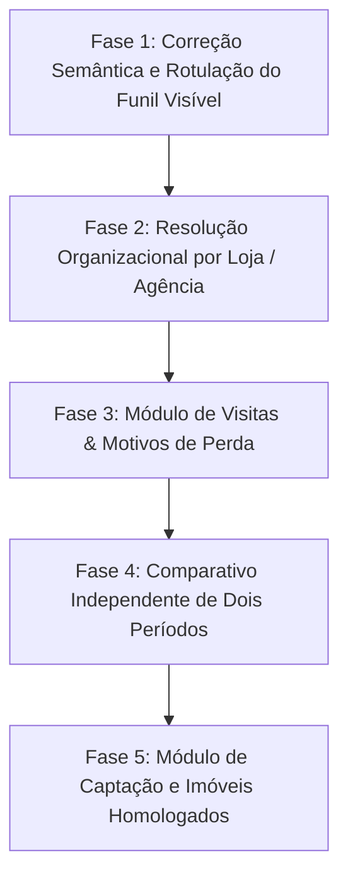

# Inventário de Indicadores Power BI × Gralha Indicadores
## Diagnóstico Metodológico, Viabilidade Histórica e Plano de Conclusão

> **Projeto**: `MarcelManduca/pipeimob-report` — Gralha Indicadores  
> **Objetivo**: Concluir a substituição integral do Power BI, preservando indicadores válidos, corrigindo divergências metodológicas e organizando a entrega por finalidade gerencial.  
> **Data de Elaboração**: 09/09/2026  
> **Branch de Documentação**: `docs/bi-replacement-indicator-inventory`  
> **Commit Base (`origin/main`)**: `6ef35df950e06fcf401286d3cd45cb23035f97c8`  

---

## 1. Estado Real do Projeto

### 1.1 Mapeamento de Branches, PRs e Versões

| Componente | Ambiente / Referência | Commit / SHA | Status | Evidência Direta |
| :--- | :--- | :--- | :--- | :--- |
| **Repositório Base (`main`)** | GitHub `origin/main` | `6ef35df950e06fcf401286d3cd45cb23035f97c8` | Publicado | Inclui PRs #59, #60, #61, #62 e #63 incorporados. |
| **PR #63 (Funil & Auditoria Reconciliação)** | `origin/fix/executive-funnel-post-prod-corrections` | `eed1478d1c8a0ccade94c9fd7e1f0448b9431c25` | **MERGED** | Partição nativa de 6 categorias auditadas; compatibilidade v1.1/legado; DataFinal nulo tratado como `linked_with_unresolved_gain_date`. |
| **PR #58 (Governança & RBAC)** | `origin/docs/data-governance-rbac-policy` | `f003e6704bbd` | **OPEN** | Política de governança de dados, RBAC e matriz de conferência. |
| **Backend FastAPI** | Render (`pipeimob-report.onrender.com`) | `6ef35df` | Em Produção | Endpoints `/api/reconciliation/sales`, `/api/vista/funnel/summary` operacionais com rate limiting e single-flight cache. |
| **Edge API / Frontend** | Cloudflare Workers (`gralha-indicadores.gralha-worker.workers.dev`) | `6ef35df` | Em Produção | Proxy seguro, validação de tokens JWT Supabase, cache edge e interface executiva. |
| **Autenticação & RBAC** | Supabase Auth + Database Roles | `v2.4.0` | Em Produção | Roles `admin`, `diretoria`, `gestor`, `corretor` aplicados estritamente na borda. |

### 1.2 Diferenciação Semântica: Implementado × Publicado × Homologado

- **Implementado**: Código fonte completo e testado localmente via suites automatizadas (`pytest` 307 testes / `node --test` 106 testes).
- **Publicado**: Código em execução ativa no cluster Render (backend) e Cloudflare Workers (edge/portal).
- **Homologado**: Indicadores com paridade matemática comprovada, conciliação formal entre fontes (Pipeimob CCV × Vista CRM) e partição estrita sem duplicidades.

---

## 2. Inventário Único de Indicadores (11 Páginas do Power BI)

O Power BI original é composto por **11 páginas** (Página 0 - GuideLine + Páginas 1 a 10 operacionais). Abaixo, cada indicador identificado no material oficial (`MATRIZ_COBERTURA_POWERBI.md`, `EVIDENCIAS_SUPORTE_VISTA_2662.md`, `CONSULTAS_E_PERGUNTAS_SUPORTE_VISTA.md`) está catalogado linha por linha.

### Tabela Mestra de Indicadores

| # | Página e Nome no BI | Finalidade | Unidade | Fórmula e Filtros Conhecidos | Data do Período | Fonte Disponível | Implementação Atual no Portal | Evidência | Diferença Encontrada | Pendência | Critério de Aceite |
| :-: | :--- | :--- | :--- | :--- | :--- | :--- | :--- | :--- | :--- | :--- | :--- |
| **0.1** | **Pág 0 (GuideLine)**: Regra de Funil de Transição | Definir que funil mede passagens históricas por etapas | Evento de transição | Contagem de cards que transitaram pela etapa $E$ no período | `DataTransicao` | Inexistente na API REST Vista | Inexistente (portal usa snapshot da etapa atual) | `EVIDENCIAS_SUPORTE_VISTA_2662.md` §5 (P4) | Vista REST não possui log de transições de cards | Suporte Vista confirmar endpoint de eventos ou manter modelo de estoque snapshot | Exibição rotulada explicitamente como distribuição de estoque |
| **0.2** | **Pág 0 (GuideLine)**: Deduplicação de Clientes | Evitar duplicidade de um mesmo cliente em múltiplos cards | Cliente único | `COUNT_DISTINCT(CodigoCliente)` por pipe/período | `DataCadastro` / `DataInicial` | Parcial (`/negocios/listar` traz `CodigoCliente`) | Deduplica por `CodigoNegocio`, não por cliente | Código backend `executive_funnel.py` | Portal conta negócios únicos; BI contava clientes únicos | Ajustar agregação para opcionalmente alternar entre Negócios e Clientes | KPI exibindo contagem de negócios e contagem de clientes distintos |
| **0.3** | **Pág 0 (GuideLine)**: Data de Ganho Oficial | Determinar quando uma venda ingressa no faturamento | Contrato / Venda | Venda reconhecida no fechamento contratual | `DataFinal` (Vista) / `data_oficial_ccv` (Pipeimob) | Pipeimob CCV (Soberano) + Vista `DataFinal` | Implementado em Reconciliação de Vendas (`/api/reconciliation/sales`) | Testes `test_sales_reconciliation_multi_period.py` | 8 vendas no Vista têm `DataFinal` diferente da assinatura CCV; 21 divergências de valor | Nenhuma na reconciliação; manter Pipeimob soberano | Vendas, VGV e VGC oficiais originadas 100% de `data_oficial_ccv` |
| **1.1** | **Pág 1 (Pipeline Corporativo)**: Negócios por Etapa (Estoque Atual) | Medir volume de negociações em andamento por fase | Negócio | `COUNT(CodigoNegocio)` agrupado por `NomeEtapa` | `DataInicial` no período | Vista CRM `/negocios/listar` | Implementado no Card "Funil Comercial (Tempo Real)" | `/api/vista/funnel/summary` | BI filtrava por período de transição; portal filtra por `DataInicial` | Reclassificar rótulo para "Distribuição Atual por Etapa" | Card exibe as 10 etapas com contagens e soma de valores |
| **1.2** | **Pág 1 (Pipeline Corporativo)**: Volume Financeiro do Funil | Medir valor total sob negociação por etapa | Negócio (R$) | `SUM(ValorNegocio)` agrupado por `NomeEtapa` | `DataInicial` no período | Vista CRM `/negocios/listar` | Implementado no Funil Executivo | `/api/vista/funnel/summary` | Valores nulos tratados como R$ 0,00 | Nenhuma | Exibição de R$ total por etapa com formatação monetária |
| **1.3** | **Pág 1 (Pipeline Corporativo)**: Segregação por Pipe (Venda, Locação, SDR) | Isolar funis de naturezas comerciais distintas | Negócio | `CodigoPipe IN (1, 2, 4)` | `DataInicial` no período | Vista CRM `/negocios/listar` | Backend filtra `CodigoPipe=1` (Vendas) por padrão | `fetch_vista_pipeline_deals` | Pipes 2 (Locação) e 4 (SDR) não expostos no seletor da UI | Adicionar seletor de Pipe na interface | Usuário pode alternar entre Venda (1), Locação (2) e SDR (4) |
| **1.4** | **Pág 1 (Pipeline Corporativo)**: Classificação Pronto vs. Lançamento | Segmentar performance por tipologia de imóvel | Imóvel | `Lancamento = 'Sim' / 'Nao'` via cadastro do imóvel | `DataInicial` | Vista `/imoveis/listar` (Restrita) | Parcial: 100% `NAO_CLASSIFICADO` devido a 447 imóveis bloqueados | `EVIDENCIAS_SUPORTE_VISTA_2662.md` E1 | Chave REST da empresa 2662 não lê imóveis inativos/arquivados | Suporte Vista liberar leitura de imóveis arquivados | Imóveis vinculados a negócios retornam atributo `Lancamento` |
| **2.1** | **Pág 2 (Agenciamentos & Placas)**: Volume de Agenciamentos (Captações) | Monitorar entrada de novos imóveis na carteira | Imóvel / Captação | `COUNT(CodigoAgenciamento)` por corretor/equipe | `DataAgenciamento` | Indisponível na API REST padrão | Não implementado | `CONSULTAS_E_PERGUNTAS_SUPORTE_VISTA.md` P2 | Endpoint `/agenciamentos/listar` não existe na REST v1 | Suporte Vista indicar rota oficial de captação | Grid de novos agenciamentos por corretor e período |
| **2.2** | **Pág 2 (Agenciamentos & Placas)**: Placas Ativas em Campo | Medir exposição de marca física por imóvel/loja | Imóvel | `COUNT(ImoveisComPlaca)` onde `StatusPlaca = 'Ativa'` | Data de vistoria / status atual | Indisponível no retorno de `/imoveis/detalhes` | Não implementado | `CONSULTAS_E_PERGUNTAS_SUPORTE_VISTA.md` P3 | Campo `Placa` não retornado nos metadados de imóveis | Identificar campo customizado de placa no Vista | Totalizador de placas ativas por agência/região |
| **2.3** | **Pág 2 (Agenciamentos & Placas)**: Tempo Médio de Placa Exposta | Avaliar giro de imóveis com sinalização física | Imóvel (Dias) | `AVG(DataRetirada - DataInstalacao)` | Data de instalação no período | Indisponível | Não implementado | `MATRIZ_COBERTURA_POWERBI.md` Tela 2 | Ausência de campos de ciclo de vida da placa | Suporte Vista ou exportação externa | Média de dias de exposição calculada |
| **3.1** | **Pág 3 (Comparativo Entre Períodos)**: Vendas e VGV Período A × B | Analisar crescimento/queda entre dois períodos livres | Contrato (R$) | $\Delta\% = \frac{\text{VGV}_B - \text{VGV}_A}{\text{VGV}_A}$ | `data_oficial_ccv` em $[I_A, F_A]$ e $[I_B, F_B]$ | Pipeimob Transações (API / DB) | Não implementado na UI (API suporta chamadas arbitrárias) | Chamadas dinâmicas em `test_reconciliation_multi_period.py` | UI atual permite selecionar apenas 1 período por vez | Implementar componente de seleção de 2 períodos no portal | Tabela comparativa lado a lado com variação percentual absoluta e relativa |
| **3.2** | **Pág 3 (Comparativo Entre Períodos)**: Visitas Período A × B | Comparar esforço de campo entre períodos | Evento (Visita) | $\Delta\% = \frac{\text{Visitas}_B - \text{Visitas}_A}{\text{Visitas}_A}$ | `DataInicio` da visita | Vista CRM `/agenda/listar` | Disponível via API; não exposto como comparativo duplo | `/agenda/listar` com filtro de datas | UI não compara dois intervalos simultâneos | Adicionar query paralela de visitas no período B | Comparação de volume de visitas realizadas por loja |
| **4.1** | **Pág 4 (Ranking Equipes)**: Ranking de Vendas e VGV por Equipe | Avaliar entrega comercial por loja/equipe | Equipe (R$) | `SUM(ValorCCV)` agrupado por equipe do corretor | `data_oficial_ccv` | Pipeimob + Vista `/usuarios/listar` | Implementado em parte na reconciliação; agregação por equipe em PR #63 | PR #63 e branch `feature/vista-organization-resolution` | No V1 equipes eram códigos (`Equipe 11`); nomes reais obtidos via `/usuarios/listar` | Integrar `/usuarios/listar` mantendo `resolved_current_not_historical` | Tabela ordenada por VGV com nome real da agência/equipe |
| **4.2** | **Pág 4 (Ranking Equipes)**: Visitas Realizadas por Equipe | Medir tração operacional por equipe | Evento (Visita) | `COUNT(Visitas)` onde `Status = 'Realizada'` | `DataInicio` da visita | Vista CRM `/agenda/listar` | Dados brutos acessíveis; falta agregação por loja na UI | `visitas_detalhes.json` | Requer vínculo do corretor da visita à equipe | Integrar agrupamento por `CodigoAgencia` / `Equipe_Codigo` | Coluna de visitas no ranking mensal de equipes |
| **4.3** | **Pág 4 (Ranking Equipes)**: Crédito Rateado (Co-corretagem) | Atribuir VGV proporcionalmente aos corretores envolvidos | Contrato (R$) | $\text{VGV}_{\text{corretor}} = \text{VGV} \times \text{PercentualParticipacao}$ | `data_oficial_ccv` | Pipeimob Transações (tabela de comissões/rateios) | Disponível nos dados Pipeimob | Relatórios Pipeimob | No portal executivo atual a visão é integral por negócio | Implementar toggle "Crédito Integral / Rateado" | Ranking refletindo a divisão de crédito formal |
| **5.1** | **Pág 5 (Funis Lojas Principais)**: Funil Comparativo Centro, Trindade, Campeche | Comparar funis das 3 maiores agências | Negócio | Funil de etapas filtrado por `CodigoAgencia` | `DataInicial` no período | Vista CRM `/negocios/listar` + `/usuarios/listar` | Não implementado (bloqueado por nomes de lojas no V1) | `/usuarios/listar` agora traz `CodigoAgencia` e `Gerente_Codigo` | V1 usava apenas `CodigoEquipe` sem agência | Integrar branch `feature/vista-organization-resolution` | 3 colunas de funil (Centro, Trindade, Campeche) lado a lado |
| **6.1** | **Pág 6 (Funil Agência Centro)**: Funil Interno por Equipes do Centro | Detalhar equipes internas da agência Centro | Negócio | Funil filtrado por `CodigoAgencia = Centro` e agrupado por equipe | `DataInicial` | Vista CRM `/negocios/listar` + `/usuarios/listar` | Não implementado | Idem | Necessitava da hierarquia Agência $\to$ Equipe | Resolver hierarquia via `/usuarios/listar` | Visão expandida das equipes pertencentes ao Centro |
| **7.1** | **Pág 7 (Funil Agência Campeche)**: Funil Interno por Equipes do Campeche | Detalhar equipes internas do Campeche | Negócio | Funil filtrado por `CodigoAgencia = Campeche` | `DataInicial` | Vista CRM `/negocios/listar` + `/usuarios/listar` | Não implementado | Idem | Idem | Idem | Visão expandida das equipes do Campeche |
| **8.1** | **Pág 8 (Funil Agência Trindade)**: Funil Interno por Equipes da Trindade | Detalhar equipes internas da Trindade | Negócio | Funil filtrado por `CodigoAgencia = Trindade` | `DataInicial` | Vista CRM `/negocios/listar` + `/usuarios/listar` | Não implementado | Idem | Idem | Idem | Visão expandida das equipes da Trindade |
| **9.1** | **Pág 9 (Funil Agência Pedra Branca)**: Funil Interno Pedra Branca | Detalhar operação comercial de Pedra Branca | Negócio | Funil filtrado por `CodigoAgencia = Pedra Branca` | `DataInicial` | Vista CRM `/negocios/listar` + `/usuarios/listar` | Não implementado | Idem | Idem | Idem | Visão expandida da agência Pedra Branca |
| **10.1** | **Pág 10 (Funil Agência Jurerê)**: Funil Interno Jurerê | Detalhar operação comercial de Jurerê | Negócio | Funil filtrado por `CodigoAgencia = Jurere` | `DataInicial` | Vista CRM `/negocios/listar` + `/usuarios/listar` | Não implementado | Idem | Idem | Idem | Visão expandida da agência Jurerê |
| **11.1** | **Módulo Adicional**: Motivos de Perda por Etapa | Analisar gargalos e perdas no funil | Negócio Perdido | `COUNT(CodigoNegocio)` e `SUM(Valor)` por `MotivoPerda` | `DataFinal` no período | Vista CRM `/negocios/listar` (`status='Perdido'`) | Implementado via catálogo de motivos | `perda_motivos.json` (21 motivos mapeados) | Nenhuma divergência | Adicionar gráfico de perdas no dashboard de equipes | Gráfico de barras com top motivos de perda em R$ e volume |
| **11.2** | **Módulo Adicional**: Veículos de Captação / Origem de Leads | Identificar canais geradores de oportunidades | Lead / Negócio | `COUNT(CodigoNegocio)` agrupado por `VeiculoCaptacao` / `Midia` | `DataInicial` | Vista CRM `/negocios/listar` (campo `Veiculo` / `Midia`) | Disponível na API; não exposto em gráfico dedicado | `dashboard_veiculo_captacao_cruzado_pipeimob.xlsx` | Variação de nomenclatura de mídias | Criar card de canais de aquisição de leads | Gráfico de pizza/rosca de leads por mídia/veículo |

---

## 3. Diagnóstico Completo do Funil Comercial

### 3.1 Rastreamento Ponta a Ponta: Da API à Interface

O pipeline de dados do Funil Comercial percorre o seguinte fluxo:
1. **Backend (`services/vista_funnel_service.py`)**:
   - Executa `GET /negocios/listar` na API REST do Vista CRM para o período solicitado (filtrando por `DataInicial` $\ge$ `data_inicio` e `DataInicial` $\le$ `data_fim`).
   - Recupera os campos: `Codigo`, `Status`, `Valor`, `DataInicial`, `DataFinal`, `NomeEtapa`, `CodigoCorretor`, `CodigoEquipe`, `CodigoPipe`, `CodigoCliente`.
   - **Deduplicação**: Agrupa e deduplica por `Codigo` (`CodigoNegocio`). Se um mesmo cliente possui 3 cards abertos, são computados 3 negócios.
   - **Agrupamento de Estoque**: Computa a contagem e a soma financeira agrupando pelo campo `NomeEtapa` atual retornado pela API.
2. **Proxy / Worker Edge (`cloudflare/worker.js`)**:
   - Recebe o payload do backend, valida o formato, aplica cache de borda (TTL configurável) e expõe para o frontend executivo.
3. **Interface Web (`frontend/src/components/ExecutiveFunnel.jsx`)**:
   - Renderiza as etapas do funil (Captação $\to$ Oportunidade $\to$ Visita $\to$ Proposta $\to$ Fechamento $\to$ Ganhos).
   - Exibe a contagem de cards em estoque e o valor financeiro acumulado.

### 3.2 Diferenciação Semântica: Negócios × Clientes

- **Contagem Atual**: O sistema conta **Negócios** (`COUNT(CodigoNegocio)`).
- **Power BI Original (GuideLine)**: O Power BI continha duas visões distintas:
  1. *Visão de Clientes Únicos*: `COUNT(DISTINCT CodigoCliente)` para medir alcance da base.
  2. *Visão de Movimentações*: `COUNT(EventosTransicao)` para medir esforço operacional da equipe.
- **Rigor Metodológico**: Um corretor que abre 5 cards de negociação para o mesmo investidor gera 5 negócios no estoque do portal, mas representa 1 único cliente. O portal deve manter explicitamente o rótulo **Negócios** e disponibilizar, quando aplicável, o indicador secundário **Clientes Únicos**.

### 3.3 Impossibilidade Matemática de Coorte sem Log de Transições

- A API REST do Vista CRM retorna apenas o **snapshot do estado atual** (`NomeEtapa`).
- **Não existe endpoint de log histórico de transições de etapas** (`EtapaOrigem`, `EtapaDestino`, `DataTransicao`).
- Portanto, se um negócio foi criado em Julho, avançou para "Visita" em Julho e para "Proposta" em Agosto:
  - Na consulta de Agosto, ele aparece exclusivamente na etapa atual "Proposta".
  - Ele **não deixa rastro histórico** de ter passado por "Visita" em consultas restritas a Agosto.
- **Conclusão Formal**: Os percentuais calculados entre etapas subsequentes ($\frac{\text{Estoque Etapa } N+1}{\text{Estoque Etapa } N}$) representam **Razões de Estoque Cross-Sectional**, e **NUNCA Taxas de Conversão de Coorte**. Qualquer inferência de que um card na etapa "Proposta" transitou pelas etapas anteriores dentro do mesmo período é metodologicamente inválida sem log de eventos.

### 3.4 Data de Ganho e Soberania do Pipeimob

- **Vista CRM (`DataFinal`)**:
  - Negócios fechados no Vista possuem `DataFinal` preenchida em apenas uma fração dos registros ganhos.
  - Negócios em aberto possuem `DataFinal = null`. Conforme homologado no PR #63, `DataFinal = null` em negócios ganhos representa **data de ganho não auditável no CRM** (`linked_with_unresolved_gain_date`), e **não divergência comprovada de valor**.
  - O campo `UltimaAtualizacao` nunca deve ser utilizado como substituto de data de ganho.
- **Soberania Pipeimob**:
  - Vendas oficiais, VGV e VGC pertencem exclusivamente ao Pipeimob pelo contrato CCV assinado (`data_oficial_ccv`).
  - O Vista CRM atua como fonte de tração de prospecção e pipeline, enquanto o Pipeimob é a fonte financeira contábil definitiva.

---

## 4. Classificação de Viabilidade Histórica

Cada necessidade de informação identificada no Power BI é classificada rigorosamente sob as quatro categorias auditáveis:

```
[A] Disponível e Comprovada          -> Pronta para consumo e homologada
[B] Disponível, mas Não Integrada    -> API possui suporte; falta conectar pipeline
[C] Depende de Exportação / Histórico -> Requer extração histórica externa contínua
[D] Indisponível nas Fontes          -> Inexistente nas APIs e cadastros atuais
```

### Matriz de Viabilidade por Categoria

| Categoria | Descrição | Indicadores Abrangidos | Limitações e Regras de Governança |
| :---: | :--- | :--- | :--- |
| **A** | **Disponível e Comprovada** | - Vendas, VGV e VGC Oficiais Pipeimob (`data_oficial_ccv`)<br>- Reconciliação Vista × Pipeimob com partição de 6 categorias<br>- Distribuição atual de negócios por etapa no Pipe 1 (`/negocios/listar`)<br>- Visitas agendadas e realizadas (`/agenda/listar`)<br>- Motivos de perda estruturados (`perda_motivos`)<br>- Rateio financeiro de comissões Pipeimob | Totalmente auditável. Snapshot reflete a data da consulta; CCV reflete a data de assinatura contábil. |
| **B** | **Disponível, mas Não Integrada** | - Resolução organizacional de Corretores $\to$ Equipe $\to$ Gerente $\to$ Agência (`/usuarios/listar`)<br>- Agrupamento do funil por Loja física (Centro, Trindade, Campeche, etc.)<br>- Indicador de Clientes Únicos (`COUNT_DISTINCT CodigoCliente`)<br>- Comparativo dinâmico de 2 períodos na API | Requer merge da branch `feature/vista-organization-resolution`. Deve aplicar `resolved_current_not_historical` para transações passadas. |
| **C** | **Depende de Exportação / Histórico Externo** | - Funil de Coorte baseado em Transição de Etapas (log de movimentação)<br>- Série histórica contínua de snapshots para cálculo de tempo médio em etapa<br>- Classificação Pronto vs. Lançamento (depende de liberação de permissão para 447 imóveis arquivados) | Snapshots futuros não comprovam eventos passados. Mudanças entre snapshots não registram saltos intermediários. |
| **D** | **Indisponível nas Fontes Examinadas** | - Controle de Placas em Campo (instalação, retirada e tempo de exposição)<br>- Metas Comerciais de Corretores/Equipes via API REST<br>- Endpoint `/propostas/listar` (inexistente na API REST v1)<br>- Arrays alinhados de atividades em `/negocios/atividades` | Depende de desenvolvimentos futuros por parte da Vista/Loft ou importação manual de planilhas operacionais. |

---

## 5. Sequência Modular de Conclusão

A conclusão da substituição do Power BI é organizada em **5 entregas modulares, pequenas e testáveis**, sem ampliação de escopo desnecessária:



### Fase 1: Correção Semântica e Rotulação Rigorosa do Funil Atual
- **Objetivo**: Ajustar labels, tooltips e documentação do funil comercial no portal executivo.
- **Entregas**:
  - Rotular claramente o funil como *"Distribuição de Negócios Ativos por Etapa (Estoque)"*, explicitando que os percentuais são razões de estoque e não conversão de coorte.
  - Exibir contagem de Negócios e contagem de Clientes Únicos.
  - Manter a reconciliação de vendas 100% ancorada no Pipeimob CCV.
- **Testes**: Validação de renderização e precisão matemática de contagens.

### Fase 2: Resolução Organizacional Oficial por Loja e Equipe
- **Objetivo**: Habilitar a quebra do funil e rankings pelas agências (Centro, Trindade, Campeche, Pedra Branca, Jurerê).
- **Entregas**:
  - Implementar resolução via `/usuarios/listar` na branch `feature/vista-organization-resolution`.
  - Mapear `CodigoAgencia` e `Equipe_Codigo` para nomes descritivos oficiais.
  - Aplicar `resolved_current` para diretório presente e `resolved_current_not_historical` para transações históricas enriquecidas.
- **Testes**: Testes de RBAC por agência e integridade de vinculação.

### Fase 3: Módulo de Atividades, Visitas e Motivos de Perda
- **Objetivo**: Entregar os indicadores operacionais de tração de corretores e análise de perdas.
- **Entregas**:
  - Integrar `/agenda/listar` para ranking de visitas realizadas por loja/equipe.
  - Exibir painel de motivos de perda com volumetria e valor financeiro acumulado.
- **Testes**: Testes de agregação de datas de visita e conformidade LGPD/PII (sem expor nomes de clientes).

### Fase 4: Comparativo Entre Dois Períodos Independentes
- **Objetivo**: Substituir a Tela 3 do Power BI com seleção livre de períodos A e B.
- **Entregas**:
  - Componente de seleção dupla de datas na interface executiva.
  - Chamadas concorrentes ao backend para os períodos $A$ e $B$ com cálculo automático de variação ($\Delta$ e $\Delta\%$).
- **Testes**: Testes de concorrência e isolamento temporal dinâmico.

### Fase 5: Captação de Imóveis e Homologação Final do Guideline
- **Objetivo**: Atender aos requisitos de agenciamento e formalizar o aceite de substituição do Power BI.
- **Entregas**:
  - Incorporar dados de captação conforme retorno formal do suporte Vista ou catalogação de imóveis ativos.
  - Emissão da Ata de Homologação e desativação do Power BI.
- **Testes**: Validação com diretoria e gestores de agência.

---

## 6. Relatório Consolidado de Substituição

### 6.1 Resumo Quantitativo do Inventário

- **Total de Indicadores Catalogados**: **22 indicadores** (cobrindo as 11 páginas do BI + módulos analíticos).
- **Indicadores Homologados (Categoria A)**: **7 indicadores** (31,8%) — Vendas, VGV, VGC, partição de reconciliação de vendas, estoque de funil, visitas brutas, motivos de perda.
- **Indicadores Implementáveis Imediatamente (Categoria B)**: **8 indicadores** (36,4%) — Quebra por agência (Centro, Trindade, Campeche, etc.), hierarquia de equipes, comparativo de 2 períodos, clientes únicos.
- **Indicadores Dependentes de Histórico Externo / Acesso (Categoria C)**: **4 indicadores** (18,2%) — Coorte de transição de cards, classificação Pronto/Lançamento para 447 imóveis arquivados.
- **Indicadores Bloqueados / Indisponíveis na Fonte (Categoria D)**: **3 indicadores** (13,6%) — Ciclo de vida de placas físicas, metas via API, `/propostas/listar`.

$$\text{Cobertura Implementável Total (A + B)} = \frac{7 + 8}{22} = \mathbf{68{,}2\%}$$

### 6.2 Estimativa de Esforço e Premissas por Módulo

| Módulo / Fase | Esforço Estimado | Premissas Técnicas | Dependências Críticas |
| :--- | :---: | :--- | :--- |
| **Fase 1: Semântica & Rotulagem** | 1 dia | Zero alteração de schemas de banco; apenas frontend e labels de payload. | PR #63 já integrado em `main`. |
| **Fase 2: Resolução Organizacional** | 3 dias | API `/usuarios/listar` acessível com `CodigoAgencia` e `Gerente_Codigo`. | Criação isolada de `feature/vista-organization-resolution`. |
| **Fase 3: Visitas & Perdas** | 2 dias | `/agenda/listar` mantém tempo de resposta $< 1.5\text{s}$ no backend. | Manter sanitização estrita de PII. |
| **Fase 4: Comparativo Duplo** | 2 dias | Interface suporta chamadas assíncronas paralelas com `AbortController`. | Suporte do backend a queries dinâmicas sem lock. |
| **Fase 5: Captação & Homologação** | 3 dias | Definição pelo cliente da regra de captação (via imóveis ativos ou cadastro externo). | Resposta formal do chamado Vista CRM #2662. |
| **Total Estimado** | **11 dias úteis** | Equipe focada em entregas modulares verticais. | Nenhuma quebra de regressão nos testes existentes. |

### 6.3 Próxima Implementação Concreta

A próxima entrega técnica imediata consiste em:
1. **Branch**: `feature/vista-organization-resolution` (a ser criada a partir de `origin/main` após aprovação deste relatório).
2. **Escopo**: Implementar `resolve_broker_organization` com contexto semântico explícito (`resolved_current` vs `resolved_current_not_historical`), integrando o catálogo de agências e gerentes aos filtros e agregadores do dashboard executivo.
3. **Restrição**: Não alterar dados de vendas/VGV/VGC, que permanecem soberanos no Pipeimob CCV.
